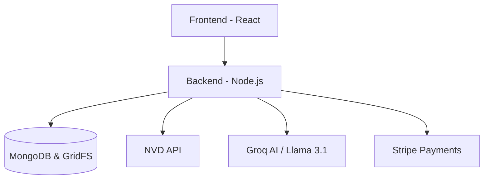
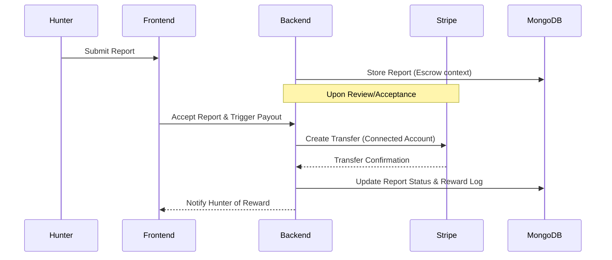
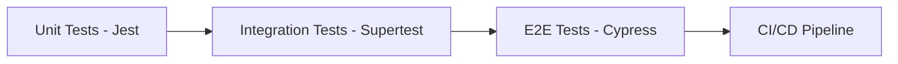

#  Secure Hunt

Secure Hunt is a professional full-stack bug bounty platform designed to bridge the gap between security researchers (hunters) and organizations. The platform streamlines the vulnerability disclosure process with AI-powered moderation, integrated CVE intelligence, and secure payment workflows.

---

## Project Overview

Secure Hunt addresses the critical need for a centralized, secure, and efficient ecosystem for bug bounty programs. Many organizations struggle with low-quality submissions and complex payout logistics, while researchers often face opaque triaging processes.

### Key Features

- **CVE Search & AI Analysis**: Real-time vulnerability search using the National Vulnerability Database (NVD) API, enhanced by AI to provide actionable security insights.
- **AI-Powered Bug Submission**: Intelligent moderation using Groq AI (Llama 3.1) to evaluate report quality and technical depth before triaging.
- **Secure Payment System**: Integrated Stripe transfers to automate bounty payouts upon report acceptance.
- **Multi-Role Dashboard**: Tailored experiences for Hunters (track submissions), Companies (manage programs), and Administrators (system oversight).
- **Interactive Security Forum**: A community hub for researchers to share knowledge and discuss emerging threats.

---

## Architecture

Secure Hunt follows a modern MERN (MongoDB, Express, React, Node.js) architecture, extended with specialized AI and payment services.

### System Design & Data Flow
The platform facilitates a seamless flow of data:
1.  **Frontend (React)**: Handles user interactions and state management.
2.  **Backend (Node.js/Express)**: Orchestrates business logic, authentication, and service integration.
3.  **Database (MongoDB)**: Stores user data, project details, and vulnerability reports (using GridFS for file uploads).
4.  **External Services**: Interacts with the NVD API for CVE data, Groq AI for moderation, and Stripe for financial transactions.



---

## Payment Flow (Stripe)

Secure Hunt ensures that researchers are paid promptly when their findings are validated.



---

## Testing Strategy

Our testing philosophy ensures reliability across all layers of the application.



### E2E Test Execution


- **Unit & Integration**: Jest and Supertest are used to validate backend controllers, models, and API routes.
- **End-to-End (E2E)**: Cypress (running on Firefox) tests the full user journey from signup to bug submission.
- **CI/CD**: Automated pipelines on GitHub Actions run the full test suite on every pull request.

---

## Setup & Installation

### Prerequisites
- Node.js (v18+)
- MongoDB Atlas account
- Stripe Developer account
- Groq AI API Key

### Local Setup
1.  **Clone the repository**:
    ```bash
    git clone https://github.com/your-repo/secure-hunt.git
    cd secure-hunt
    ```

2.  **Backend Configuration**:
    Navigate to `/backend` and create a `.env` file:
    ```env
    PORT=5001
    MONGO_URI=your_mongodb_uri
    JWT_SECRET=your_jwt_secret
    STRIPE_SECRET_KEY=your_stripe_key
    GROQ_API_KEY=your_groq_key
    ```
    Install dependencies and start:
    ```bash
    npm install
    npm run dev
    ```

3.  **Frontend Configuration**:
    Navigate to `/frontend` and create a `.env` file:
    ```env
    VITE_API_URL=http://localhost:5001/api
    ```
    Install dependencies and start:
    ```bash
    npm install
    npm run dev
    ```

### Running Tests
- Backend: `npm test` (from /backend)
- Frontend E2E: `npm run test:e2e` (from /frontend)

---

## Security Considerations

- **API Key Handling**: All keys are strictly managed via environment variables and never committed to version control.
- **Validation & Rate Limiting**: All inputs are validated via Joi/Mongoose, and sensitive endpoints are rate-limited to prevent brute-force attacks.
- **AI Moderation**: Prevents platform abuse and report spamming by screening submissions for technical relevance.
- **Stripe Sandbox**: All financial flows are implemented using Stripe's test mode to ensure security before production deployment.

---

## API Documentation

| Endpoint | Method | Description |
| :--- | :--- | :--- |
| `/api/auth/register` | POST | Register a new user (Hunter/Company) |
| `/api/cves/:product` | GET | Fetch CVEs from NVD API |
| `/api/reports` | POST | Submit vulnerability report (GridFS upload) |
| `/api/reports/:id/status` | PUT | Update report status (Accepted triggers payout) |
| `/api/projects` | GET | List all available bug bounty programs |

---

## Deployment & Tech Stack

- **Frontend**: [https://securehunt.vercel.app](https://securehunt.vercel.app) (React, Vercel)
- **Backend API**: [https://secure-hunt-backend.onrender.com](https://secure-hunt-backend.onrender.com) (Node.js/Express, Render)
- **Database**: **MongoDB Atlas** (Cloud MongoDB, Shared Cluster)

---

## Future Improvements

- **Scalability**: Implementing Redis for caching NVD API results to reduce latency and rate-limit hits.
- **AI Enhancements**: Fine-tuning Llama models to provide more specialized code fix suggestions.
- **Mobile App**: Developing a React Native companion app for researchers to receive real-time notifications.

---

_All system diagrams and graphs in this documentation were generated using **Mermaid.js**._